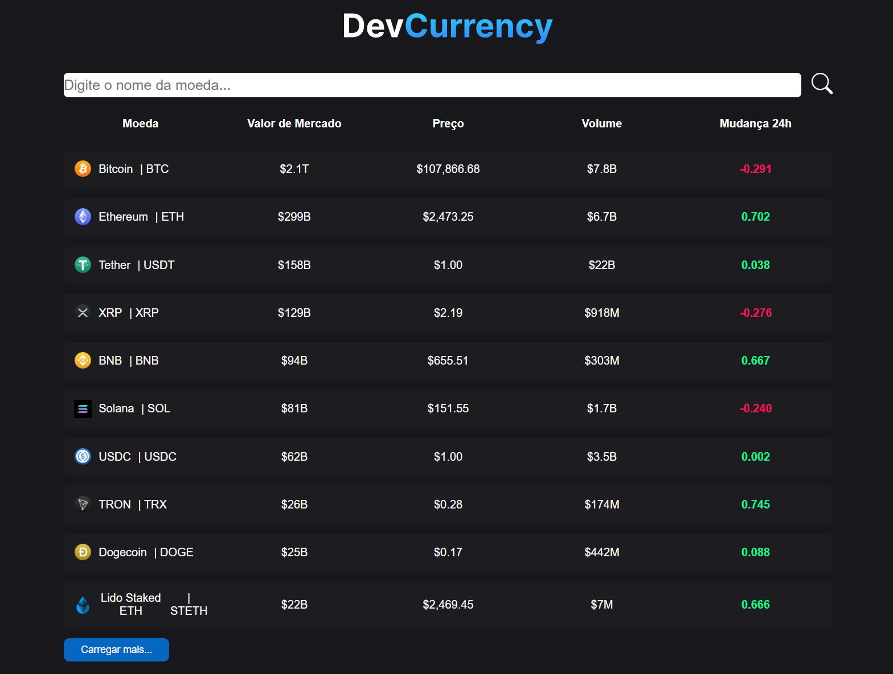

# 💲 DevCurrency

DevCurrency é uma aplicação web que exibe informações atualizadas sobre criptomoedas, como nome, valor de mercado, preço, volume e mudança nas últimas 24 horas. O usuário pode pesquisar moedas pelo nome, navegar pela lista e carregar mais resultados.

## 🚀 Funcionalidades

- Nome e símbolo da moeda
- Valor de mercado
- Preço atual
- Volume negociado
- Variação percentual nas últimas 24 horas, com indicação visual positiva (verde) ou negativa (vermelho)

## 🛠️ Tecnologias utilizadas

- ReactJS
- TypeScript
- CSS
- Vite

## 📸 Imagem do projeto
